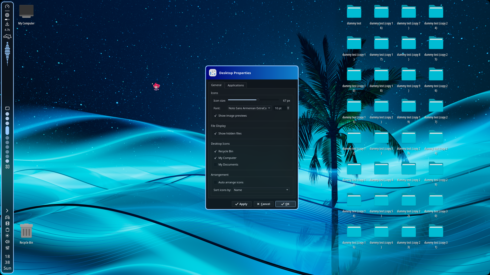

# HyprSillyDesktopIcons

> A modified and updated version of [Oh My Desktop](https://github.com/EduuG/oh-my-desktop), renamed as [**HyprSillyDesktopIcons**](https://github.com/cherryCTL/HyprSillyDesktopIcons).
>
> This version was updated for my personal use, mainly to fix parts of the project that needed updates to work with my current Hyprland setup. I did not originally know C++, so I used AI assistance to help understand and update the code.
>
> I made these changes because I wanted a working desktop icon manager for my own setup. Feel free to read through the code and review the changes before using it, especially if you run into compatibility issues on your own system.

Desktop icons manager for Hyprland. Hyprland has no built-in desktop support (as every twm), so this fills that gap.

Built with C++17 and Qt6 + LayerShellQt, it gives you a proper desktop with drag-and-drop, keyboard navigation, multi-monitor, and file watching.

<p>
  <a href="https://github.com/cherryCTL/HyprSillyDesktopIcons"></a>
  <a href="https://github.com/cherryCTL/HyprSillyDesktopIcons"></a>
  <a href="https://github.com/cherryCTL/HyprSillyDesktopIcons"></a>
  <a href="https://github.com/cherryCTL/HyprSillyDesktopIcons"></a>
  <a href="https://github.com/cherryCTL/HyprSillyDesktopIcons"></a>
</p>

<a href="screenshot.png"></a>

## Tech Stack

* **Language:** C++17
* **Framework:** Qt6 (QGraphicsScene-based icon management)
* **Wayland:** LayerShellQt for layer-surface windows
* **Compositor integration:** Hyprland IPC via socket2
* **Build:** CMake 3.20+

## Build

```bash
cd HyprSillyDesktopIcons && rm -rf build && mkdir build && cd build
cmake .. -DCMAKE_BUILD_TYPE=Release && cmake --build . -j$(nproc)
```

Requires Qt6 and LayerShellQt development packages.

## Runtime deps

`hyprctl`, `gio`, `xdg-mime`, `xdg-open`, plus any system terminal (duh)

## Run

### Hyprland (hyprlang)

For older Hyprland configurations using `hyprland.conf`:

```ini
exec-once = /full/path/to/HyprSillyDesktopIcons/build/HyprSillyDesktopIcons
```

Or if you copied the binary to `~/.local/bin/`:

```ini
exec-once = HyprSillyDesktopIcons
```

### Hyprland (Lua)

For Hyprland 0.55+ using `hyprland.lua`, start the application on the `hyprland.start` event:

```lua
hl.on("hyprland.start", function()
    hl.exec_cmd("/full/path/to/HyprSillyDesktopIcons/build/HyprSillyDesktopIcons")
end)
```

Or, if the binary is available in your `PATH`:

```lua
hl.on("hyprland.start", function()
    hl.exec_cmd("HyprSillyDesktopIcons")
end)
```

`hl.exec_cmd()` starts the process asynchronously, so no `&` or `disown` is required.

## Features

### Core

* Grid layout with manual positioning and Ctrl+multi-select
* Drag icons to move them — they snap to the nearest free cell
* Ctrl+scroll to resize icons (24-96px range)
* Image previews for common formats
* `.desktop` files use `Name=` and `Icon=` from the entry
* Pin applications to the desktop via the Properties dialog (Applications tab)
* Positions and settings saved to `~/.config/HyprSillyDesktopIcons/icon-positions.ini`

### File Management

* Drag files onto the Recycle Bin or onto folders
* (Almost) Smart text file opening
* File watcher auto-refreshes when the Desktop folder changes
* Recycle Bin accepts file drops and has "Empty Recycle Bin"

### Keyboard

* Arrows to navigate, Enter to open, Delete to trash
* Type-to-select files by name
* Full keyboard navigation without mouse

### Context Menus

* Right-click desktop: New (Folder/Document), Open in Terminal, Arrange, System actions (lock, suspend, etc.), Properties
* Right-click icons: Open, Rename, Delete, Properties
* Virtual icons: Recycle Bin, My Computer, My Documents (individually togglable)

### Wayland Integration

* Workspace switches clear menus and selection via Hyprland socket2
* Each monitor gets its own LayerShellQt window at `LayerBackground`

## How it works

### LayerShellQt windows

One desktop window per monitor, rendered as a background layer surface. This means it sits behind all other windows but stays visible — exactly what a desktop should be. When you plug in a new monitor, `screenAdded` fires and a new window is created automatically.

### The QMenu problem on Wayland

Standard `QMenu` popups don't work reliably on Wayland layer-shell surfaces. The compositor popup grab breaks and menus just don't appear. The workaround here is `InlineMenu`: context menus are implemented as child widgets (real `QWidget`s positioned under the cursor) instead of native popups. It's more code but it actually works pretty well.

### Hyprland IPC

No Hyprland-specific dependencies or compile-time coupling. Everything is runtime: `hyprctl monitors -j` to get panel areas (so the desktop doesn't draw under the Waybar or others), and a raw socket2 connection for workspace/focus events. If Hyprland isn't running or the socket is unavailable, the desktop still functions — you just lose workspace-aware behaviors.

### Grid layout

Qt doesn't have a built-in "desktop icon grid" that supports manual repositioning, rubber-band selection, and drag-to-rearrange all at once. The grid logic is custom — icons snap to cells, cells can be marked occupied, and the layout recalculates when icons are moved or resized.

## Related Projects

* [HyprFrame](https://github.com/EduuG/classic-hypr-suite/tree/main/HyprFrame) — Hyprland plugin for customizable window title bars and borders
* [show-desktop](https://github.com/EduuG/classic-hypr-suite/tree/main/show-desktop) — Bash scripts for "show desktop" via Waybar

## Roadmap

Planned features, in no particular order:

* [ ] External drag-and-drop (drag files into other apps)
* [ ] "Open with…" context menu entry
* [ ] Built-in wallpaper manager
* [ ] Desktop widgets (clock, weather, etc.)
* [ ] Trash notifications with undo
* [ ] Per-monitor files support

## Notes

This project is a personal fork and update of Oh My Desktop, mainly maintained for personal use and compatibility with my Hyprland setup.
